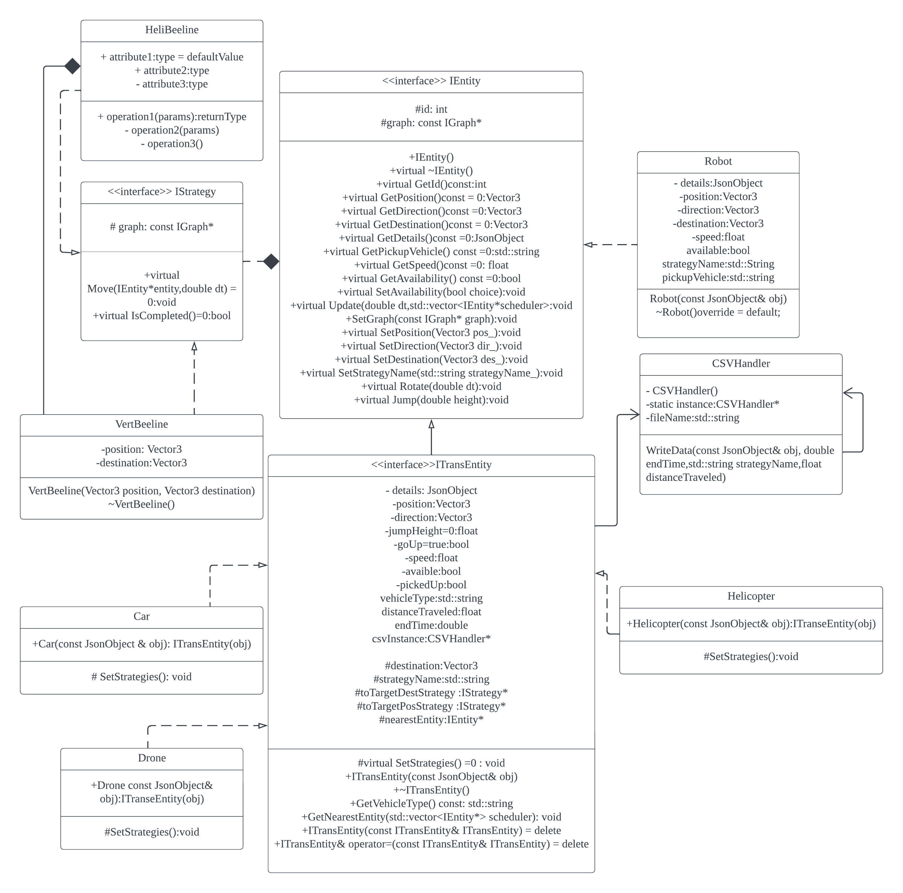

# Campus Transport Simulator
## Team-001-35-homework04
### Names and x500:
* Cole Lindfors - lindf168
* Cody Engstrom - engst316
* Hoin Jang - jang0064
- - -

## What does this simulation do?

This project is a campus transport simulation that contains robots and vehicles. 
There are two parts of the display for this simulation. One is the scheduler, which has 
a map and other options allowing you to request a trip. The fields to fill out consist 
of picking a name for your robot, your pickup vehicle, and the pathing algorithm you 
want the vehicle to take. There are multiple pathing algorithms for the drone and the 
car that follow the roads on the campus. After that, select a start and end point on 
the map and schedule a trip. In the second part of the simulation, there is a visual 
representation of the trip in a three-dimensional model of the University of Minnesota 
campus. You can watch the trips that you scheduled in real-time, along with adjusting 
the simulation speed.

- - -

## How to run the simulation

### With a Docker image (easiest)

#### The Docker repository is located [here](https://hub.docker.com/repository/docker/colelindfors/campus-transport-simulator)

1. Ensure you have Docker Desktop installed on your computer (download link [here](https://www.docker.com/products/docker-desktop/))
2. Run this command in your bash terminal to pull the Docker image 
    ```bash
    docker pull colelindfors/campus-transport-simulator
    ```
3. Run this to start the simulation
    ```bash
    docker run -it --rm -p 8081:8081 colelindfors/campus-transport-simulator
    ```
4. Navigate to http://127.0.0.1:8081/ for the simulation and 
    http://127.0.0.1:8081/schedule.html for the scheduler

### With the project files on a virtual machine

1. Forward your desired port to your local machine
2. Continue with the rest of the steps as if the project files were downloaded on your computer

### With the project files downloaded on your computer

1. Navigate to the projects directory in your terminal
2. Run this line of code in the terminal window 
    ```bash
    make -j; ./build/bin/transit_service 8081 apps/transit_service/web/
    ```
3. If you wish to switch the port the simulation is run on, change 8081 to your desired 
    port
4. Navigate to http://127.0.0.1:8081/ for the simulation and 
    http://127.0.0.1:8081/schedule.html for the scheduler

- - -

## What is this project about?

This project was about learning and putting into practice different design patterns 
into a partially completed code base. Throughout the progression of this project, 
different features and functionalities were added, along with many design patterns. 
Along with design patterns, we also used Doxygen for documenting the code, along with 
following Google code style.

- - -

## New Feature

### What does it do?

We added a few new features to the project. The first one we added was multiple pickup 
vehicles to the simulation. Before, there was only one drone that could pick up the 
robots. Now there are multiple vehicles that you could request a ride from, which 
follow different search algorithms. The drone has the same pathing strategies as 
before, where it beelines directly to the robot and then follows the selected algorithm 
once the robot is picked up. The car (although it is a hovering car) must stay close to 
the ground and has to follow the selected algorithm to the robot and then its 
destination. The helicopter has a special pathing algorithm so that it flies at an 
appropriate height above the city. It only moves towards the robot or the destination 
of the trip once it is at a safe height, so it descends and elevates back up to pick up 
the robot.

The second feature was the addition of tracking and recording vehicle trip information 
into a CSV file. This information is used by all the transport entities and records 
information on vehicle type, search strategies, speed of the vehicle, total trip time, 
and distance of the trip.

### Why is it significantly interesting?

The multiple vehicles are significantly interesting due to having more options for the 
user to pick in the simulation. This adds another aspect to the project and adds some 
variability so it isn’t always a drone moving the robots. The other thing that is 
interesting about having multiple vehicles is that the car, drone, and helicopter could 
be moving their own robot at the same time, which can help make more trips finish in a 
period of time.

The CSV implementation is interesting as it has a continuous recording of all trips 
throughout the life of the application. This means that trip data can be used to 
calculate which pathing algorithms are the fastest or which vehicles are the fastest. 
Data could be compiled into graphs and other visual representations. In addition, data 
can be used in the creation of more implementations in the future. For example, data 
could be used to calculate the cost of different vehicle trips.

### How does it add to the existing work?


The multiple vehicle aspect adds to the existing work by expanding on the logic in the 
drone class so it can be utilized by other transport vehicles. To do this we created 
another layer of abstraction with the *ITransEntity* object, which is an abstract 
transport entity that contains a majority of the functionality for the three vehicles. 
For the helicopter, we had to have a different selector on the scheduler because it 
would always travel in a beeline instead of a pathing algorithm. To do that, we added 
to the *schedule.html* file to modify the options available once the helicopter is 
selected.

The CSV implementation adds a way to track data throughout multiple runs of the 
application. This was done through a singleton pattern in the *CSVHandler* file. A 
*CSVHandler* object is then stored and shared within the transport entities.  Doing so 
means that the data can be permanently stored somewhere so it can be used at another 
time.


### Which design pattern did you choose to implement and why?


For the multiple vehicle functionality design patterns, the first one we used was the 
strategy behavioral design pattern. To make our simulation run as we wanted, we needed 
to modify existing pathing strategies and make new ones for the helicopter. This new 
helicopter strategy *HeliBeeline* is a piece of the strategy design pattern. We also 
implemented a facade structural design pattern with the pickup vehicle selector. The 
pickup vehicle selected is abstracted down from an entity to a transport entity, then 
to its final concrete vehicle. This is a moderately complex set of classes and 
abstractions that is needed just to have a car pick you up instead of a drone.

For the CSV functionality, we used the singleton design pattern. The singleton design 
pattern was used as we want to ensure only one instance of our *CSVHandler* is created. 
The reason for this is that we want to control access to the CSV file. This singleton 
implementation ensures that the CSV output file is only opened one time during the 
simulation and ensures that only one entity can write to the file at a time.

### Instructions to use this new feature

To select a different pickup vehicle, simply use the selector on the scheduler page. The search strategy options update accordingly, and you can view your vehicle on the simulation just as you would the drone.
To use the new CSV feature, schedule a pickup trip through the scheduler page and let the vehicles complete their trips. Then access the CSV output file located in the csv_data folder. The data in the CSV file is laid out in this order:

\<*Vehicle*>, \<*Search Strategy*>, \<*Speed*>, \<*Trip Time*>, \<*Distance From Pickup to Destination*>

- - -

## Sprint Retrospective


There are a lot of things that went well throughout our sprint, but there are some 
things that we would have done differently. We did great at getting together virtually 
at scheduled times frequently, which helped everyone stay in the loop and on track with 
their contributions. We also did well at dividing the tasks and collaborating on some 
difficult ones to prevent anyone from getting stuck. Using the Jira board effectively 
was great so we could look at what everyone was working on, along with other tasks we 
needed to complete in the future. One thing we could have done better was set up a more 
clear plan on how to implement the multiple-vehicle feature. On our first attempt, the 
abstract transport entity was a concrete entity, and there were no more car, 
helicopter, or drone classes. This clouded up the *GetNearestEntity* function with a 
confusing array of if-statements before we re-added the concrete vehicle classes back. 
This error caused some work to be repeated to recreate classes that were previously 
deconstructed.

In addition, it was our first-time implementing code as a team where teammates were 
working on the same files or deleting and restructuring the codebase at the same time. 
This led to some unnecessary implementations of our CSV class design. One way we could 
prevent this issue in the future would be to spend more time scheduling and planning 
our code design before diving into the code itself.

The development process we chose to use was a modified version of Scrum. We ran one 
sprint due to our limited time frame and modified our daily standup to occur a few 
times a week to fit in with our schedules. We also did not have a project manager or 
scrum master, so we acted as those as a collective.

- - -
## UML

### UML diagram of new features



- - -

## Video Presentation

### [Link to video](https://drive.google.com/file/d/1Q4rBrg43SvcX_XyWc1zCzE36oL4gUFa9/view?usp=share_link)
